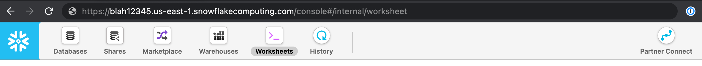
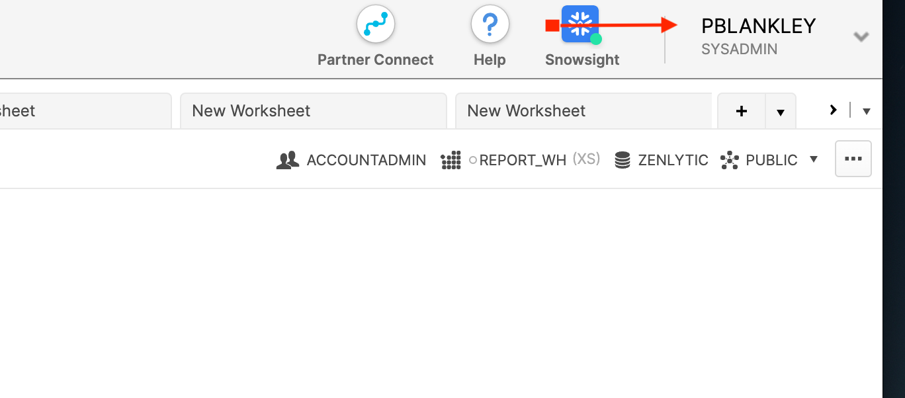
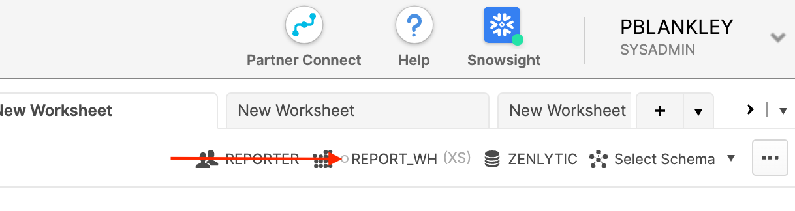

# Snowflake Setup

To connect Zenlytic to Snowflake, you'll need to create a user account and configure the connection. Here's how to do it:

## Step 1: Create a Snowflake User

1. Log into your Snowflake account as an admin
2. Go to "Users" in the admin panel
3. Click "Create User"
4. Set a username (e.g., "zenlytic_user")
5. Set a secure password
6. Assign appropriate roles (typically "PUBLIC" and any custom roles needed)

## Step 2: Grant Permissions

Run the following SQL commands to grant necessary permissions:

```sql
-- Grant usage on warehouse
GRANT USAGE ON WAREHOUSE <your_warehouse_name> TO ROLE <your_role_name>;

-- Grant usage on database
GRANT USAGE ON DATABASE <your_database_name> TO ROLE <your_role_name>;

-- Grant usage on schema
GRANT USAGE ON SCHEMA <your_database_name>.<your_schema_name> TO ROLE <your_role_name>;

-- Grant select on all tables in schema
GRANT SELECT ON ALL TABLES IN SCHEMA <your_database_name>.<your_schema_name> TO ROLE <your_role_name>;
```



## Step 3: Add the Connection in Zenlytic

1. In Zenlytic, go to Settings > Data Sources
2. Click "Add Data Source"
3. Select "Snowflake" from the list
4. Enter the connection details:
   - **Account**: Your Snowflake account identifier
   - **Username**: The username you created
   - **Password**: The password for the user
   - **Warehouse**: The warehouse name
   - **Database**: The database name
   - **Schema**: The schema name (optional)



## Step 4: Test Your Connection

1. Click "Test Connection" to verify it works
2. If successful, click "Save"
3. You should now be able to see your Snowflake tables in Zenlytic



## Step 5: Configure Advanced Settings (Optional)

If you need to specify additional settings:

- **Role**: If you want to use a specific role other than the default
- **Session Parameters**: Any custom session parameters


## Troubleshooting

If you encounter connection issues:

1. Verify the account identifier is correct
2. Check that the user has the necessary permissions
3. Ensure the warehouse is running
4. Verify the database and schema names are correct

