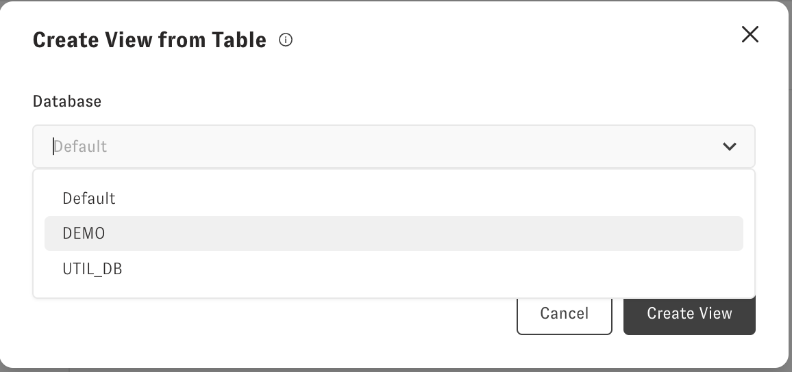
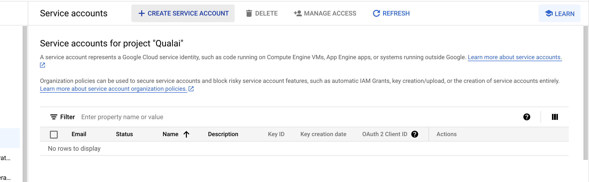
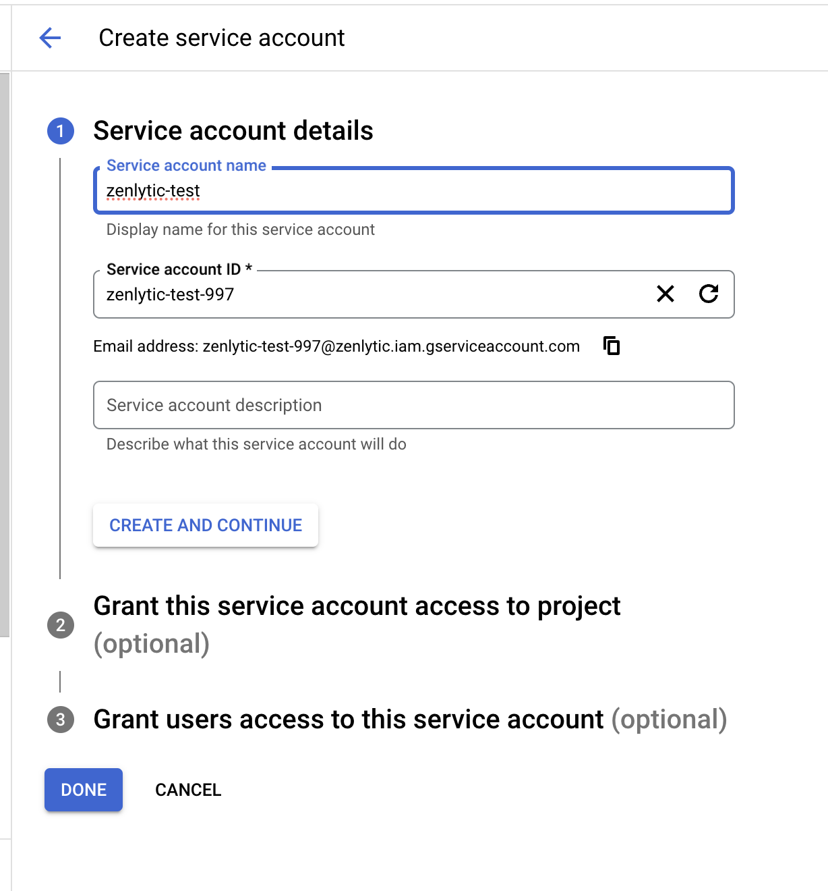
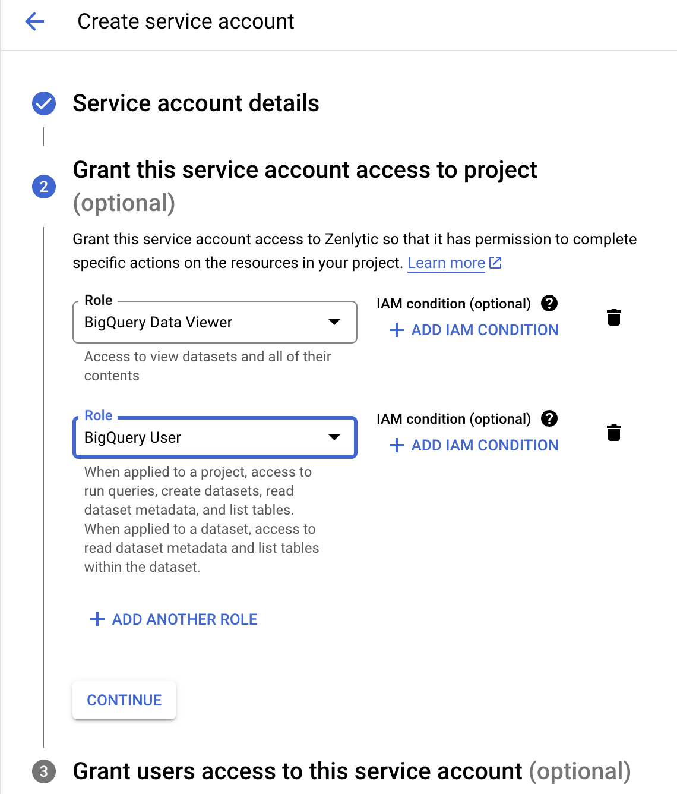
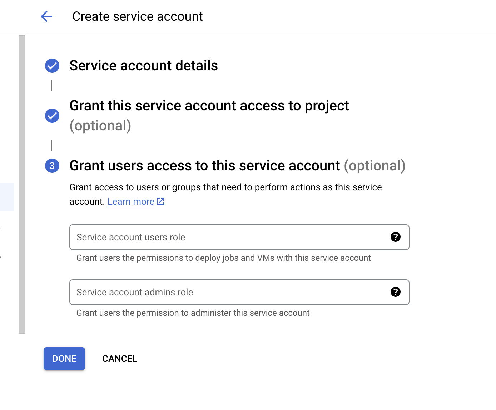
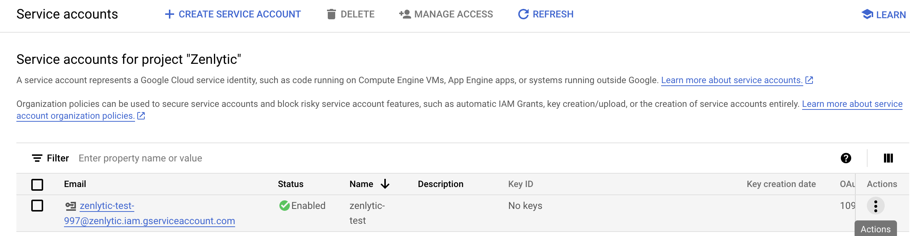
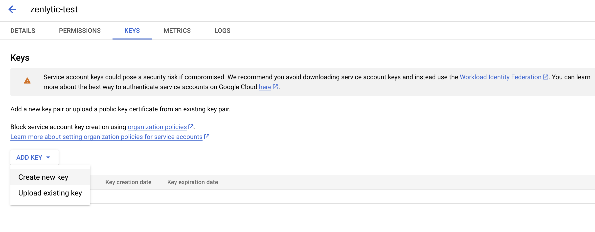
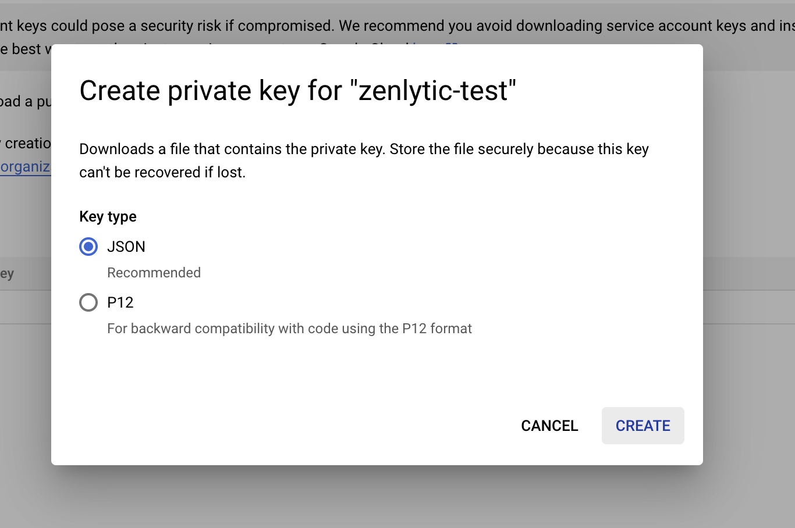

# BigQuery setup

> Connect your BigQuery data warehouse to Zenlytic

This document will help you connect your BigQuery data warehouse to Zenlytic to access modern, LLM-powered business intelligence.


Connection Name
---------------


First, you'll name your connection. This name is how Zenlytic's [model](https://docs.zenlytic.com/docs/data_modeling/model) connects the credentials you'll enter in the next step to your data warehouse. You can name the credential whatever you want, but we usually recommend naming it something like `my_company_name` to keep things simple.


BigQuery JSON
-------------


You'll [create a Service Account](https://cloud.google.com/iam/docs/keys-create-delete#creating) (for more step-by-step instructions on creating a service account, go to the bottom of this document) in your Google Cloud Platform to access BigQuery. When you create this Service Account, you'll need to give it two permissions on BigQuery:


* bigquery.dataViewer ([link](https://cloud.google.com/bigquery/docs/access-control#bigquery.dataViewer))
* bigquery.user ([link](https://cloud.google.com/bigquery/docs/access-control#bigquery.user))

Once you do that, you'll get a JSON for your service account. You'll put that JSON into Zenlytic, and that's all there is to it.


Advanced Settings
=================


If you're running BigQuery in a specific region, you'll need to specify that here. If you let BigQuery manage that for you, you can leave this field blank.


BigQuery Region
---------------


This is only for BigQuery when you specify the region you want to run in. If that is your situation, enter the region like `us-central1`


If you see no tables or datasets returned, then you likely need to specify the region. 


Note
----


You *must* select a dataset to display associated tables in BigQuery. There is no default value. In this menu, you must select a dataset (e.g. `DEMO` here)



### IP Whitelisting


If you use IP whitelisting in your data warehouse, whitelist the following IP addresses:


```
184.73.175.163  
18.209.132.30
```


Creating a Service Account
--------------------------


To create a service account, go to the Google Cloud IAM page (link) and ensure you are signed into the project with the BigQuery instance you want to connect.


Next, click on Create Service Account on the page.




Next, enter service account details like this. The names do not matter specifically, but it helps to put Zenlytic in the name to know why you created the service account in the future.




Next, grant the user BigQuery Data Viewer and BigQuery User permissions in the next step in the form.



Then, click "Continue," ignore the following optional fields, and click "Done."



Now, you'll click the three-dot menu on the service account you just created (under "Actions"). In that menu, select "Manage Keys."



Finally, you will create a key for your service account. 



Create the key as a JSON type; when you do that, the key will be saved to your computer. Copy the contents of that file into Zenlytic's input box for BigQuery, and test the connection to make sure you've connected as you expected.


