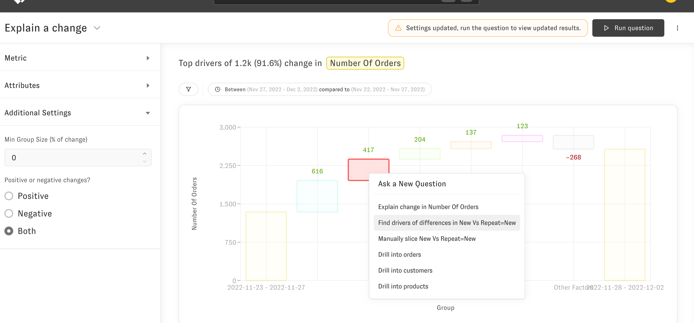
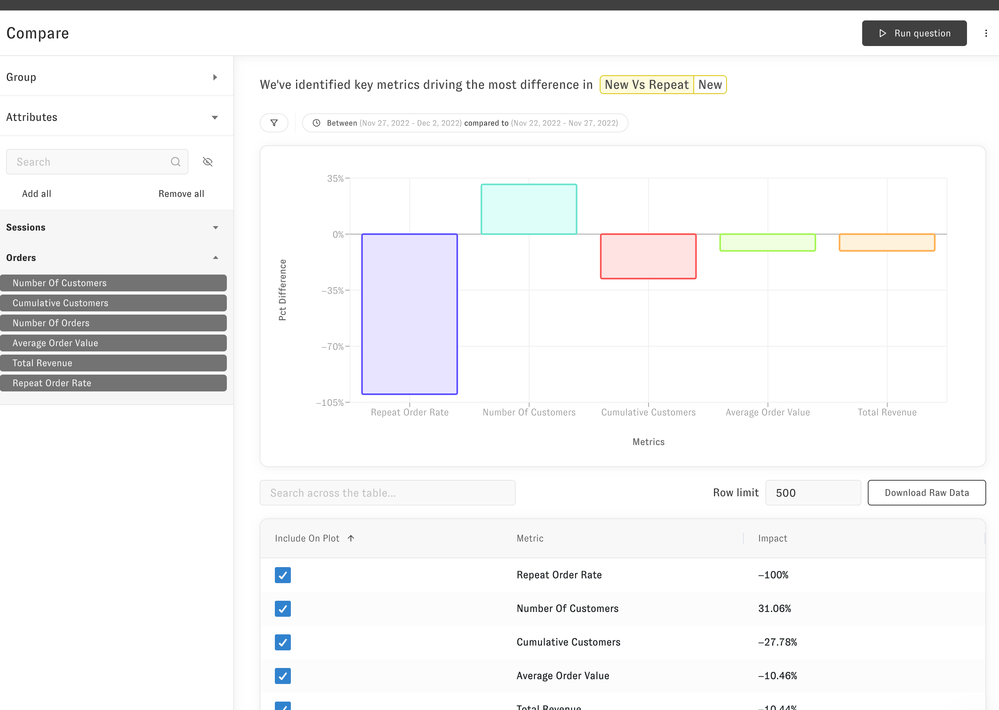

# Compare

> The compare question helps you find differences between groups in your data

Compare questions tell you what's different about a specific group compared to the rest of your data (e.g. what's different in orders I get from paid ads vs. orders I get elsewhere). You can access this question after an [Explain Change](https://intercom.help/zenlytic/en/articles/6927539-explain-change) or from an explore plot by clicking on the group you'd like to analyze. 

  
To get to the compare question, click on the "Find what makes X distinctive" follow-up question.

  
Then you'll see a result like this. The attributes, like in the [Explain Change](https://intercom.help/zenlytic/en/articles/6927539-explain-change), let you select which metrics to include in your question.

