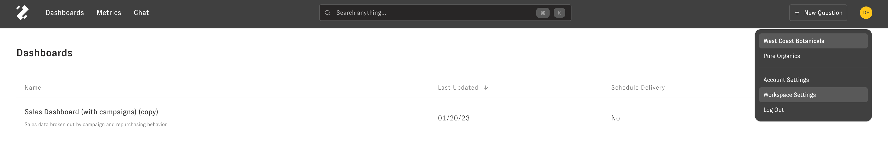
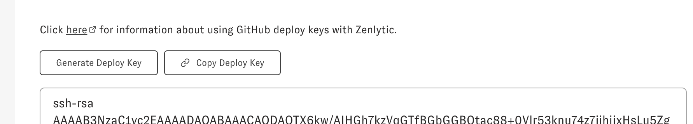
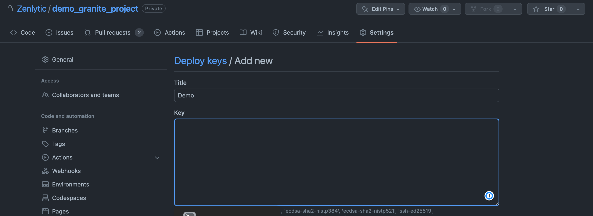
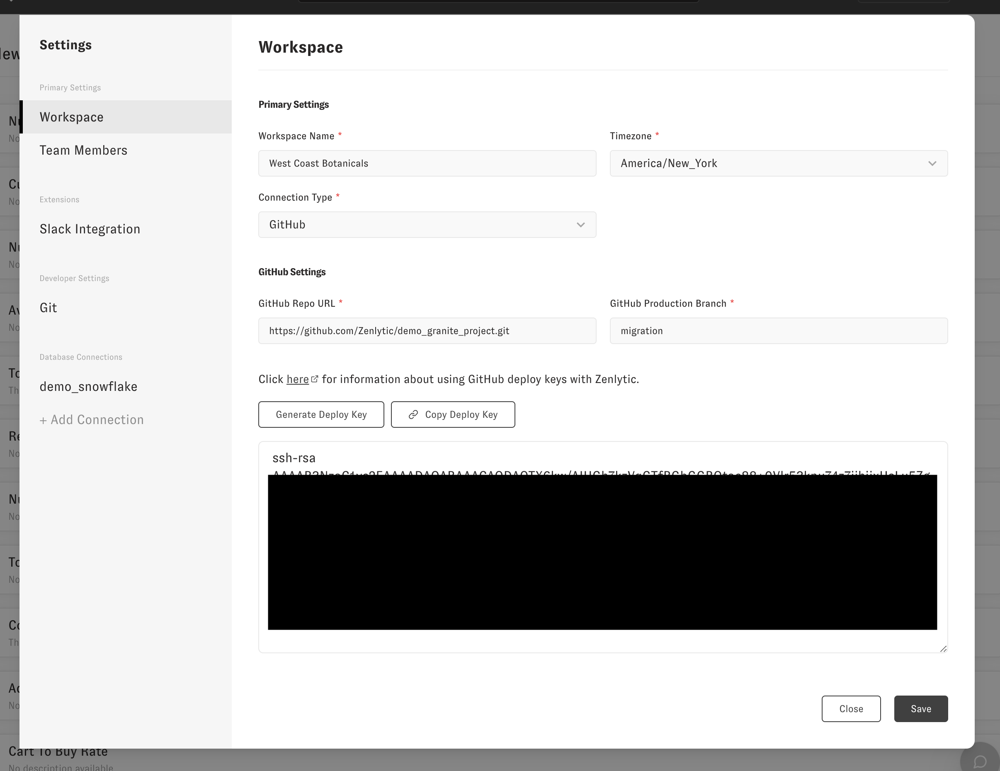

# Connecting to Github with a Deploy Key

Creating a Deploy Key
=====================

In Zenlytic, you'll first go into Settings, then Workspace Settings

Next, find your git repo details (these will be in Github). 

Make sure to use the "SSH" format of the git URL. The format looks like `git@github.com:<YOUR_ORGANIZATION>/<YOUR_REPO>.git`, and you can find it here in your Github repo under the "Code" button with the SSH tab as shown below.

Now that you have that URL and the branch you want to use as your production branch, return to Zenlytic. In this example, we pasted our Github repo url (SSH format) and our production branch, which was: `master`.

Next we need to generate the SSH key we'll use to connect. Hit the "Generate Deploy Key" button, then the "Confirm" button, and copy the public SSH key generated.

Then hit Copy Deploy Key.

Now that you have the deploy key copied return to Github and go to "Settings."

Then go to Deploy Keys in the left-hand menu.

Then, click "Add new" and give your deploy key a name. Finally, paste that SSH key and click "Add Key." 

Then click "Save" in the Zenlytic UI. If this saves without an error, you can close the window. You're fully connected to Github!

