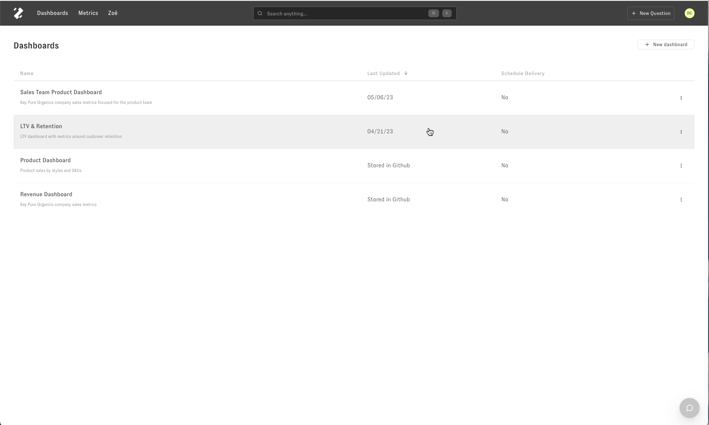
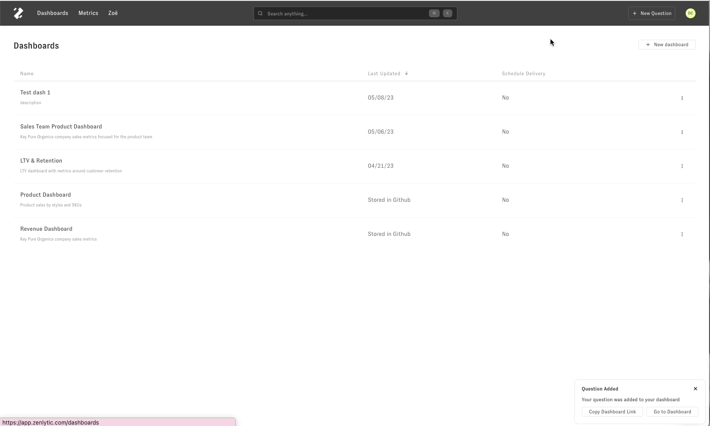

# Creating a new dashboard

> This article explains creating a new dashboard using the 'New Dashboard' button or saving a question plot to a new dashboard

There are two ways of creating a new dashboard in Zenlytic. 

Using the 'New Dashboard' button
--------------------------------

The first way to create a new dashboard is by clicking on 'New Dashboard' in the top right-hand corner of the Dashboard page.   
​

Saving from the questions page
------------------------------

The second way to create a new dashboard is by creating a question plot first and then saving the question to a New Dashboard.   
  
Create a new question, and once you are satisfied with your question results and formatting, click on the 3-dot menu in the top right-hand corner of the question section.  
Select the option 'Save to new dashboard' from the drop-down. 

