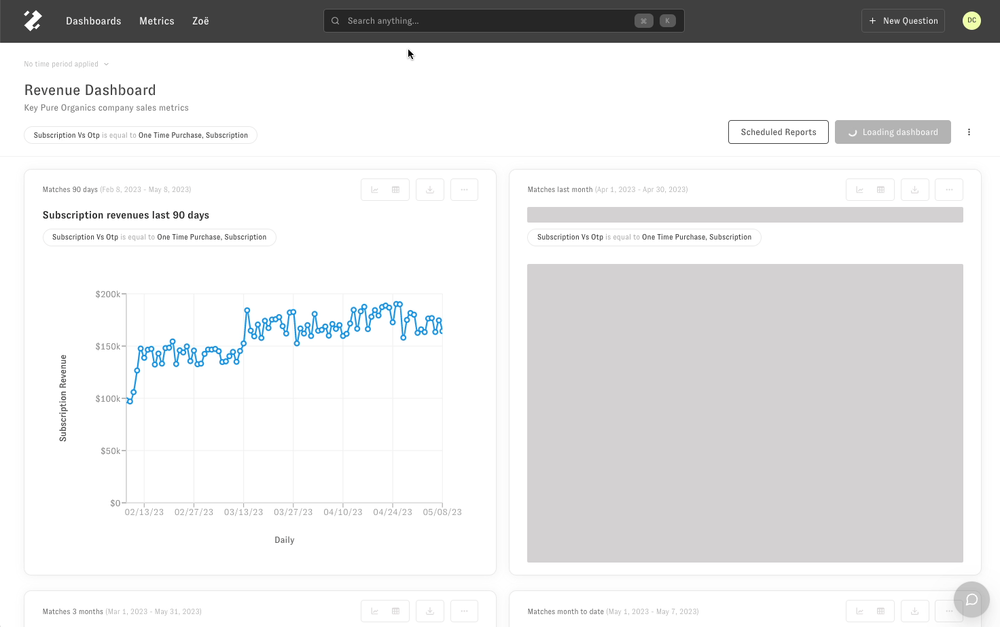
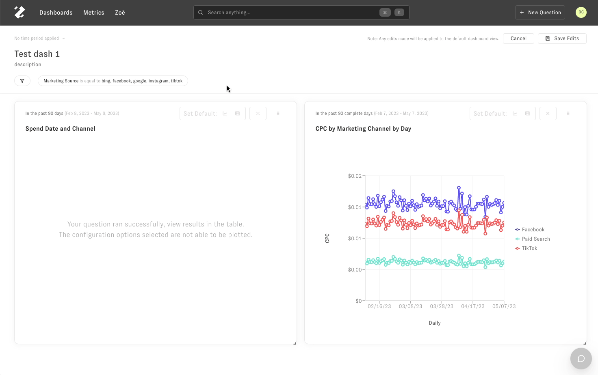
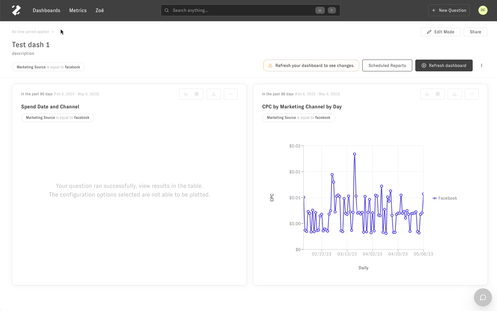

# Dashboard Filters

> How to edit dashboard filters and how changing the default values of a filter affects all future use of dashboard

Using dashboard filters
-----------------------

Dashboard filters will take precedence over any chart filters in a dashboard.   
  
Changing the values of the dashboard filter will not change the default value of the filter if you open the dashboard in another session or another user opens the dashboard.   
  
To change the default values for a dashboard filter, you'd have to enter into edit mode (see next section).   
​

Editing dashboard filters
-------------------------

To edit the default values of a dashboard filter for all users who see the dashboard, click on 'Edit Mode' in the top right hand corner of the screen. This means that any other user who opens this dashboard in the future will see those values as default filter values for the entire dashboard. 

Select the filter pill you'd like to change the values for. Select or deselect values you want applied. Click on 'Save Edits' in the top right hand corner. Click on 'Refresh dashboard' to see the changes.   
​

This same behavior is applied for the time period filter's default values as shown below.

