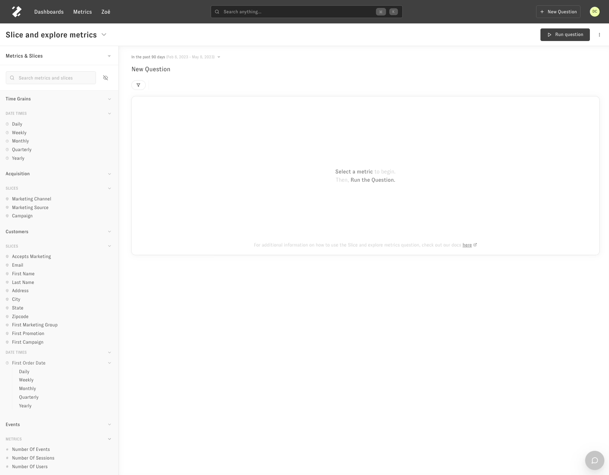

# Dashboards

> Overview of adding to dashboards, editing them, following up, and dashboard filters

Dashboards are how you save questions to refer back to in the future. You can access dashboards by navigating to the dashboard page in the main navigation bar. 

With dashboards, you can do the following: [links]

* [Creating a new dashboard](https://app.intercom.com/a/apps/jdz661k7/articles/articles/7880469/show)
* [Save a chart to an existing dashboard](https://intercom.help/zenlytic/en/articles/7880475-editing-dashboards)
* [Modify sharing and permissions on dashboards](https://intercom.help/zenlytic/en/articles/7880172-workspace-groups-and-permissions)
* [Edit existing dashboards](https://intercom.help/zenlytic/en/articles/7880475-editing-dashboards)
* [Create or edit dashboard filters](https://intercom.help/zenlytic/en/articles/7880483-dashboard-filters)
* [And follow up with new question from a dashboard](https://intercom.help/zenlytic/en/articles/7880491-following-up-from-a-dashboard)

