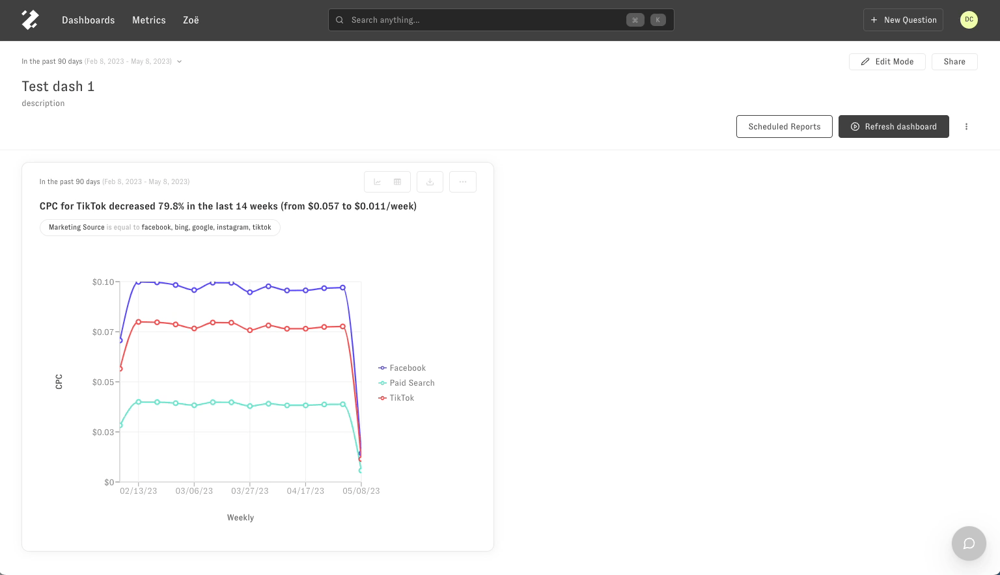
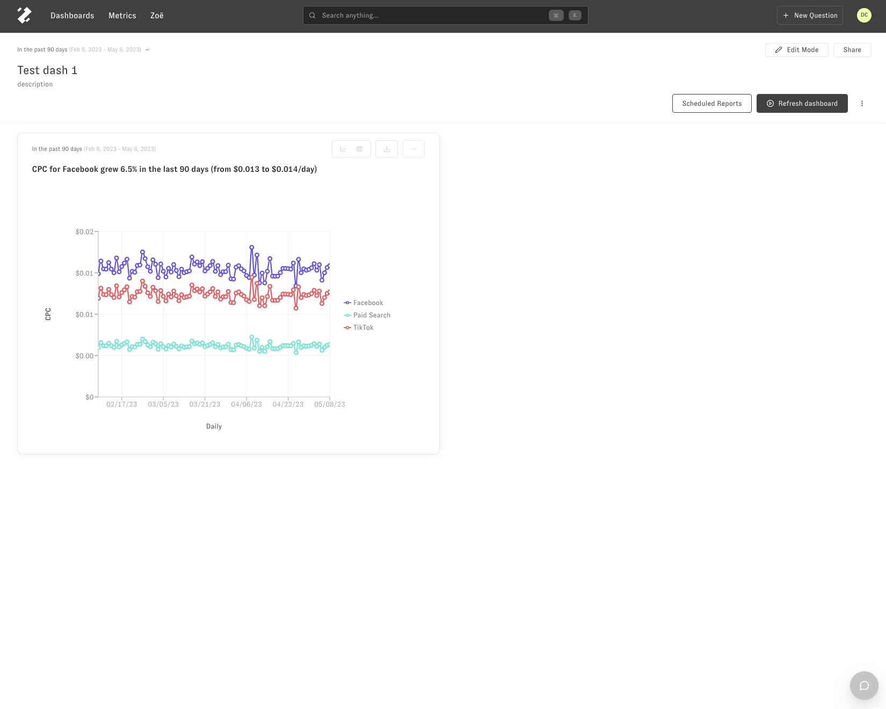

# Following up from a dashboard

There are two ways you can follow up from a dashboard question in Zenlytic. 

The first is entering an explore interface, where you can select metrics, slices, and filters from a list. 

The second is by chatting with [Zöe](https://www.zenlytic.com/product#:~:text=a%20data%20nerd-,Z%C3%B6e,-finds%20the%20answers), our natural language chatbot. 

For both options, select the 3-dot menu in the top right-hand corner of a chart in a dashboard.

Explore from here
-----------------

Start a chat with Zöe
---------------------

