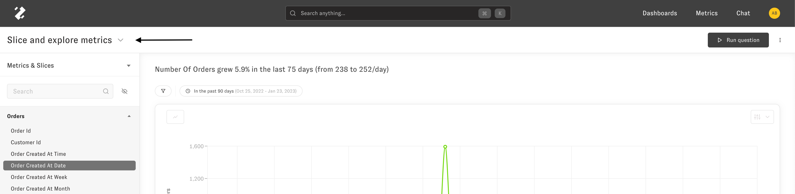
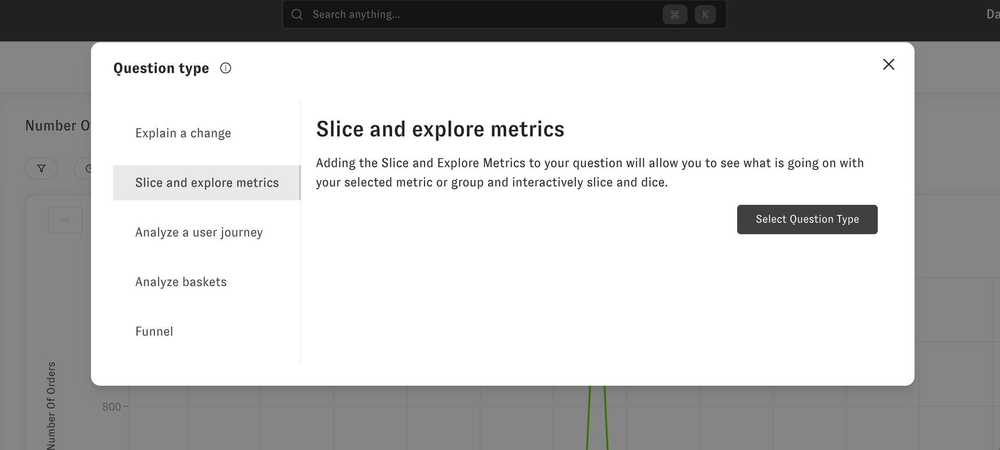
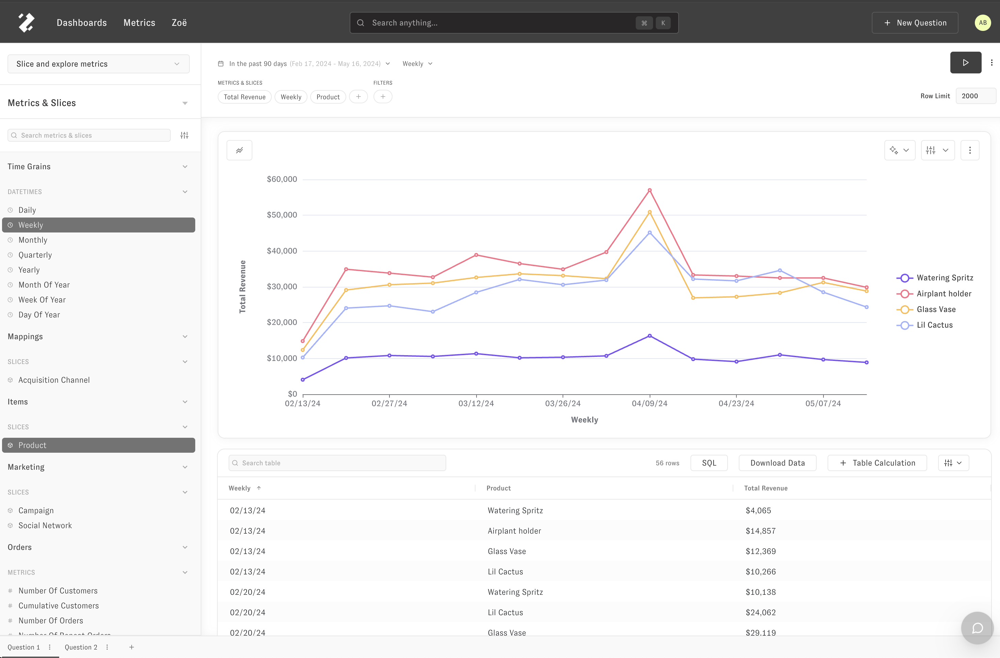
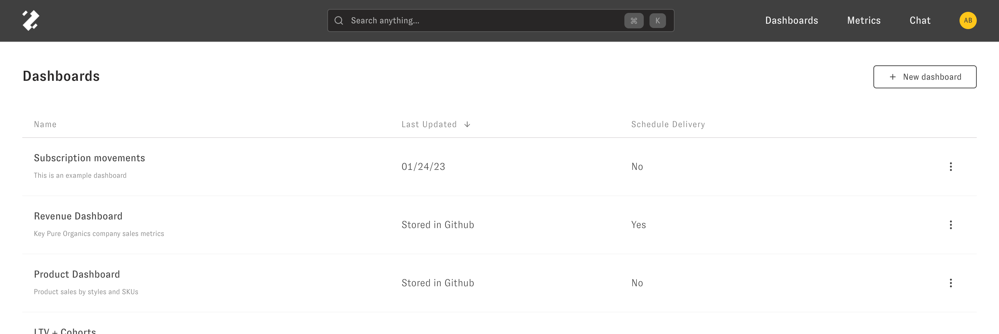
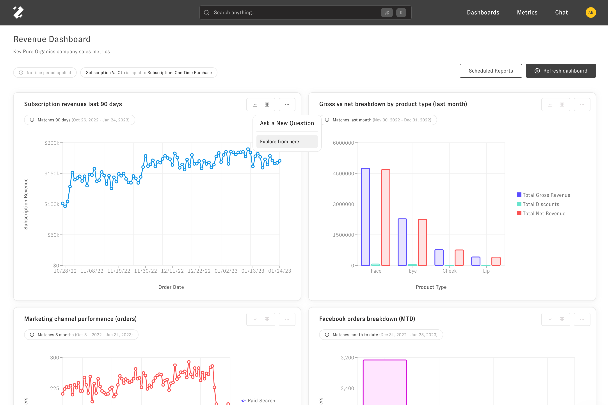

# Getting Started

> This is an overview of what you can do in Zenlytic and the types of questions you can ask. Start here!

Zenlytic is an AI-powered business intelligence platform that helps you understand the "Why" behind your data. There are several different "question types" you can ask and answer in Zenlytic. You can change the "question type" asked using this menu from the interactive question page.

Then you'll see the model to change the "question type."

**Question Types**
------------------

* **Explore:** The [explore question](https://intercom.help/zenlytic/en/articles/6927245-slice-and-explore) is a general-purpose question where you can answer the "What" questions that lead to the "Why" questions. For example, you could look at number of customers by acquisition channel who have spent more than $200 in the last 3 months in this question type. You can [slice](https://intercom.help/zenlytic/en/articles/6927245-slice-and-explore#h_401d32a18f) and [filter](https://intercom.help/zenlytic/en/articles/6927245-slice-and-explore#h_bfc6e6d64b) key metrics easily.  
​
* **Explain Change:** The [explain change question](https://intercom.help/zenlytic/en/articles/6927539-explain-change) lets you answer the question, "Why did this metric change?" You can change this question at any time, or drag/click on the plot to ask a explain change follow-up question to figure out why your metric is spiking.  
​
* **Analyze Baskets:** The [baskets question](https://intercom.help/zenlytic/en/articles/6927574-baskets) lets you quickly look at baskets of goods customers purchase from you. For example, you could figure out which two products your customers most often buy together, to better inform how you promote bundles of products or organize your online store.  
​
* **Funnel:** The [funnel question](https://intercom.help/zenlytic/en/articles/6927598-funnel) lets you quickly look at sequences of customer interactions with you. This can be anything in your database, like individual clicks on your site, marketing/sales touch points, or orders. For example, you could figure out how many customers, after making an order through a paid channel, come back and make another order from any channel.

  
​

**Zoë**
-------

You can also access your data via a chat interface (which is also the homepage) and have Zoë, your AI analyst, answer your questions  
​

**Dashboards**
---------------

You can also access saved views of your data using dashboards. To get to the list of your company's dashboards, you can click on the Dashboards option in the top navigation bar. Then to go to a dashboard, click on its name.  
​

  
On a dashboard, you can click the three dots and then "Explore from here" on any of the plots to go into an interactive interface to ask follow-up questions about the plot.   
​

