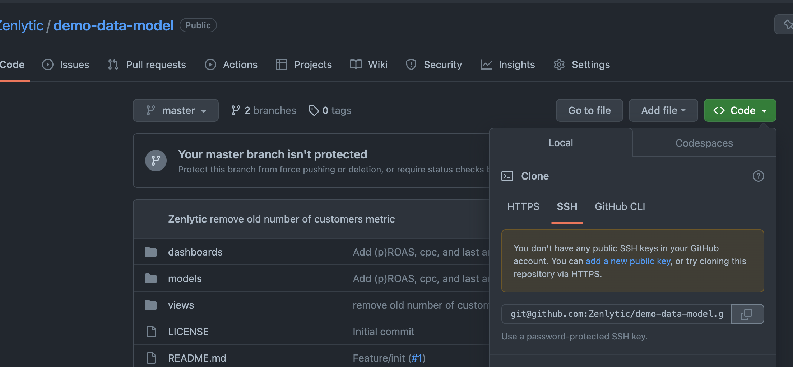
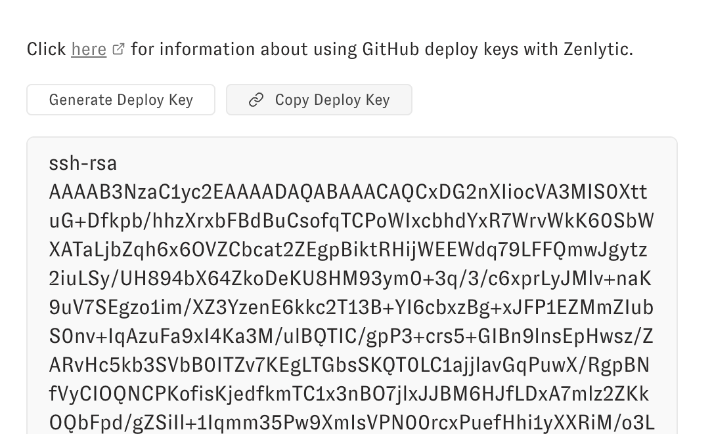
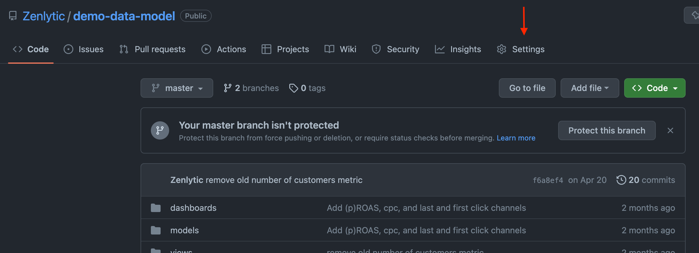
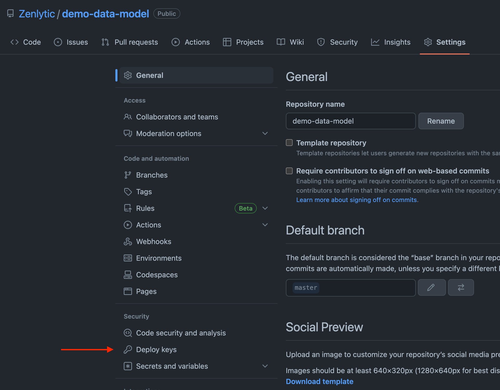
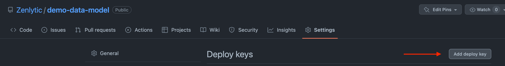
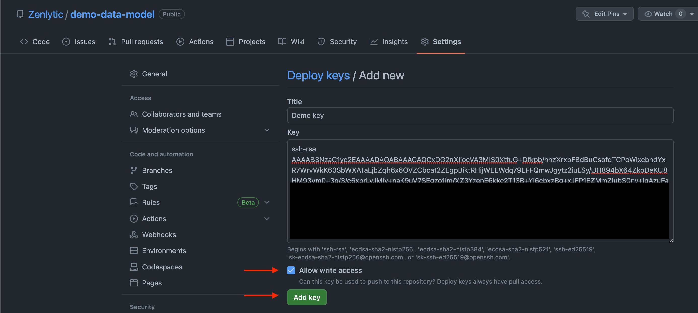

# Git (data model) setup

> How to connect to your data model stored in a git repo

This document will help you connect your Zenlytic to a git repo. ***If unsure of what's happening in this step, select the "Managed Repo" option and click Next.*** 

Managed Repo
============

The Managed Repo will provision and configure a git repo (hosted on Github) and wholly managed for you by Zenlytic. 

This is the easiest way to get started, and if you ever want to move the git repo to your organization, Zenlytic support will transfer ownership to you. You'll never be locked in.

Connect an Existing Repo
========================

You'll use this option if you have an existing git repo you want to connect or if you want to make a new git repo in your organization.

Git Repo URL
------------

This is the SSH URL for your git repo. You can find this value by going to your repo's homepage, clicking "Code," then clicking SSH. You'll know you're looking at the right value if it starts with `git@`

In this example, the Git Repo URL is `git@github.com:Zenlytic/demo-data-model.git`

Git Production Branch
---------------------

This is the branch you want to use as your "Production" branch. Common defaults are `main` or `master`. 

In this example, the production branch is `master`

Deploy Key
----------

The most secure way to connect to your git repo is via SSH. You can do this in all major git providers (e.g. Github or Gitlab) using Deploy Keys. For example, using Github (separate docs for Gitlab at [this link](https://docs.gitlab.com/ee/user/project/deploy_keys/))

You'll start by generating a Deploy Key in the Zenlytic UI. 

Now, copy the Deploy Key to your clipboard.

Next go to your git provider (in this example Github). Click on "Settings."

Next, click on "Deploy Keys."

Next, click on "Add Deploy Key" 

Finally, give your deploy key a name ("Zenlytic Access" is a common one), paste your deploy key under the "Key" heading, and ***check "Allow Write Access."*** Allowing write access will let you use Zenlytic's UI to manage the data model, making the process much easier with less pushing and pulling from your local branch.

Click "Add Key" once you've filled out the values like above, and you're all set. You'll now go back to the Zenlytic UI and click Test Connection to verify that the connection is successful. Then you'll click Next to move forward in the onboarding process.

