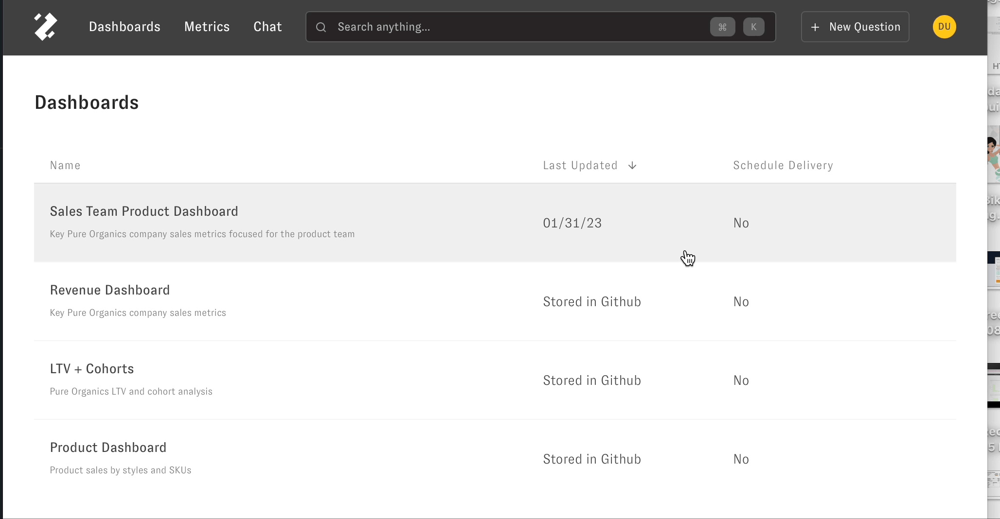
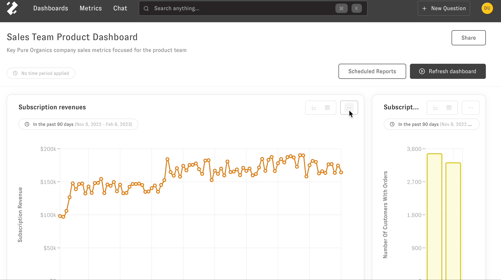
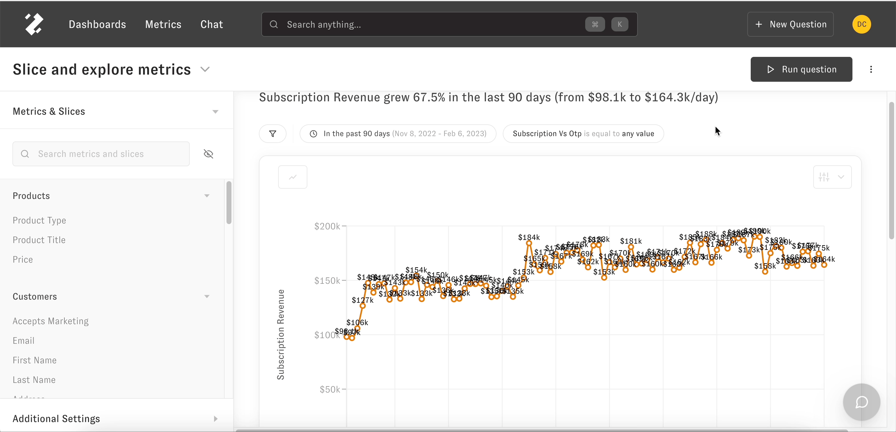

# Slice and Explore

> This article overviews how to query metrics and slices

The Slice and Explore Metrics question lets you answer the "What" questions about your data. You can get to this question by [searching your data](https://intercom.help/zenlytic/en/articles/6927253-using-zenlytic#h_f10aeb1456), [clicking on a metric](https://intercom.help/zenlytic/en/articles/6927253-using-zenlytic#h_16be460248), [following up from a dashboard](https://intercom.help/zenlytic/en/articles/6927253-using-zenlytic#h_458995a971), or [following up from chat](https://intercom.help/zenlytic/en/articles/6927253-using-zenlytic#h_0e78591cea). 

Navigating to Slice and Explore
-------------------------------

There are several ways to navigate to Slice and Explore your data.

#### Using the 'New Question' button in the navigation bar

#### From a dashboard using the 'Explore from here' button

Saving your question to a dashboard
-----------------------------------

Save your Slice and Explore question to an existing or new dashboard by clicking the 3 dots on the upper right hand side of the page next to the 'Run Question' button.

